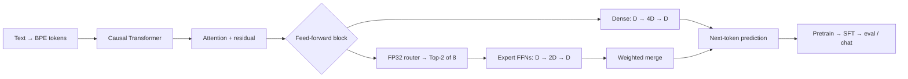

# NanoChat MoE

**Turn a compact language-model training framework into a sparse-expert laboratory.**

[](LICENSE)
[](bundle/moe/pyproject.toml)


[English](README.md) · [简体中文](README.zh-CN.md) · [Quick start](#quick-start) · [Results](#measured-results) · [Repair case study](docs/routing-repair.md)

NanoChat MoE extends [Andrej Karpathy's NanoChat](https://github.com/karpathy/nanochat/tree/92d63d4e8bb4df75c3b71618f31ddde2378b2bcd) with alternating sparse MoE feed-forward layers while retaining its tokenizer, pretraining, full-parameter SFT, checkpoint, evaluation, and KV-cache inference workflow.

The interesting part is more than replacing an MLP: **inspect expert traffic, detect a collapse that a falling loss hides, recover a real training run, and evaluate the entire pipeline.**

## Why try it?

- **Readable Top-2 MoE.** Eight independent ReLU² experts per MoE layer, FP32 routing, normalized gates, and a load-balancing auxiliary loss. Follow the dispatch and gradient paths in ordinary PyTorch.
- **A complete learning workflow.** Keep a Dense baseline beside the MoE implementation; go from raw text and a trained BPE tokenizer to pretraining, SFT, evaluation, and chat.
- **Routing you can actually inspect.** Per-layer/per-expert selection, Top-1, gate mass, router probability, CV, and separate prefill/decode reports, with aggregation across eight data-parallel ranks.
- **A real failure and recovery.** The 20-layer run concentrated about 99.8% of last-layer selections on two experts. The documented R5 recovery restored expert use and passed a fixed-window quality check before continuation.
- **Measured, qualified results.** Dense12, MoE12, and MoE20-R5 were trained and evaluated. The release distinguishes what was measured from what would require a controlled ablation.

> **Release scope:** source code, tests, training/evaluation entry points, experiment tables, and figures. Pretrained Base and SFT weights **are not bundled or publicly hosted in this release**. See [weight availability](docs/weights.md).

## What changed?



Every second Transformer block uses MoE. The other blocks retain the upstream Dense FFN. Each MoE layer owns its own experts: the 20-layer model has **10 MoE layers and 80 expert FFNs**.

For one replaced FFN, the eight experts store approximately **4× the original FFN matrix parameters**, while Top-2 with half-width experts retains approximately the same active FFN matrix work per token. Routing, gather/scatter, attention, and memory traffic add overhead; this is not a claim of equal wall-clock speed.

**Eight GPUs are data-parallel replicas with sharded optimizer updates/state.** Every GPU holds all experts. This implementation does not use expert parallelism, cross-GPU token All-to-All, or a PyTorch DDP wrapper.

Read the [architecture guide](docs/architecture.md) for equations, precision, gradients, optimizer behavior, and routing denominators.

## Quick start

### 1. Run a small, offline correctness check

Requires Python 3.10+ and [uv](https://docs.astral.sh/uv/). The selected tests use tiny models and do not download a dataset or a pretrained model.

```bash
git clone https://github.com/lite93597/nanochat-moe.git nanochat-moe
cd nanochat-moe/bundle/moe
uv sync --extra cpu --group dev
NANOCHAT_DTYPE=float32 uv run --extra cpu --group dev pytest -q \
  tests/test_moe.py tests/test_moe_training_metrics.py \
  tests/test_moe_repair_diagnostics.py tests/test_infer_bench.py
```

PowerShell:

```powershell
git clone https://github.com/lite93597/nanochat-moe.git nanochat-moe
cd nanochat-moe/bundle/moe
uv sync --extra cpu --group dev
$env:NANOCHAT_DTYPE = "float32"
uv run --extra cpu --group dev pytest -q tests/test_moe.py tests/test_moe_training_metrics.py tests/test_moe_repair_diagnostics.py tests/test_infer_bench.py
```

### 2. Train on your own node

CUDA setup:

```bash
# Continue from bundle/moe after Step 1.
uv sync --extra gpu --group dev
source .venv/bin/activate
export NANOCHAT_BASE_DIR=/persistent/nanochat-moe/models
export NANOCHAT_DATA_DIR=/persistent/nanochat-moe/data
export NANOCHAT_DTYPE=bfloat16
```

From the repository root, `runs/train_moe12.sh` and `runs/train_dense12.sh` pretrain on prepared data; `runs/evaluate.sh` evaluates your Base/SFT checkpoints. Start with the [reproduction guide](docs/reproduction.md): it separates data preparation, a short capacity check, full training, and evaluation. It also explains why the historical R5 run needs its actual source checkpoint and cannot be recreated by silently turning on a flag.

Training has been exercised on **8× RTX PRO 6000 Blackwell Server Edition**. Choose a fresh model tag and check memory/throughput on your hardware before a full run. Upstream Dense speedrun timings do not apply to this MoE fork.

### 3. Talk to a model you trained

With its tokenizer and checkpoint under `NANOCHAT_BASE_DIR`:

```bash
python -m scripts.chat_cli -i sft -g YOUR_MODEL_TAG \
  -p "Explain why the sky looks blue." --max-tokens 128 \
  --moe-routing-output ./chat_routes.json
```

Each answer can produce a routing summary and machine-readable expert statistics.

## Measured results


| Metric | Dense12 | MoE12 | MoE20-R5 |
|---|---:|---:|---:|
| CORE, 22-task mean centered score ↑ | 0.127071 | 0.128288 | **0.224274** |
| Base validation BPB ↓ | 0.869251 | 0.853670 | **0.746360** |
| SFT ARC-Easy | 36.32% | 37.71% | **54.34%** |
| SFT ARC-Challenge | 31.40% | 31.91% | **44.11%** |
| SFT MMLU | 31.53% | 31.69% | **34.50%** |
| SFT GSM8K | 0.53% | 0.61% | **4.25%** |
| SFT HumanEval | 9.15% | 7.93% | **13.41%** |

The final evaluation covered **22 CORE tasks / 91,037 questions**, five full chat tasks, and additional BPB, sampling, inference, and benchmark stages: **31 stages total**. CORE is a mean chance-normalized task score, not overall raw accuracy.

| Model | Depth / width | MoE layers | Total parameters | Active-parameter accounting | Pretrain updates | Configured pretrain positions |
|---|---|---:|---:|---:|---:|---:|
| Dense12 | 12 / 768 | 0 | 286,261,730 | 286,261,730 | 1,680 | 880,803,840 |
| MoE12 | 12 / 768 | 6 | 371,233,250 | 286,298,594 | 1,680 | 880,803,840 |
| MoE20-R5 | 20 / 1280 | 10 | 1,289,852,146 | 896,636,146 | 6,641 | 3,481,796,608 |

“Positions” are scheduled sequence positions, not a count of unique corpus tokens. Active-parameter accounting includes shared embeddings and is not a FLOP measurement.

**Inference snapshot:** on one RTX PRO 6000, prompt length 256, requested output 64, temperature 0: **58.0 decode tok/s at batch 1**, and **454.3 aggregate tok/s at batch 8**. The batch-8 benchmark expands one prompt into eight continuations; it is not an eight-user serving benchmark. Dense inference was measured on different hardware, so these results do not establish an architecture speed ranking.

### Read the results with these limits

- MoE20 changes **depth, width, training budget, and the repair recipe together**. Its improvement does not isolate the causal effect of MoE or layer count.
- Dense12 vs. MoE12 is closer in configuration, but task results are mixed and there are no multi-seed significance estimates.
- **The inherited SFT validation candidate pool includes test examples from MMLU and GSM8K that overlap final benchmarks.** Monitoring used no gradients and did not select a best checkpoint; the final test set was nevertheless not completely untouched. A future strict experiment should split validation from training data instead.
- These are predominantly English benchmark results, not a validation of a Chinese or domain-specific assistant. GSM8K remains low in absolute terms.
- This release reports pretraining and full-parameter SFT. Retained upstream RL code is not an executed RL result.

See [protocols, full counts, and limitations](docs/experiments.md).

## Expert collapse: the part loss did not tell us


In the last MoE layer, two experts took about 99.8% of assignments while BPB was still improving. The recovery combined independent expert parameter copies, a targeted optimizer-state reset, training-window bias calibration, and bounded bias feedback. It then passed a 100-update quality check and continued to complete pretraining and SFT.

| Last-layer diagnostic | Final pretrain | Final SFT |
|---|---:|---:|
| Load CV ↓ | 0.128178 | 0.155499 |
| Minimum assignment share | 10.4135% | 10.1877% |

All eight experts were used in these final diagnostics. Task-dependent routing remains nonuniform, and short prompts can legitimately leave an expert unused. Read the [repair case study](docs/routing-repair.md) for the actual intervention and its limits.

## Repository map

```text
bundle/dense/       Upstream Dense baseline snapshot
bundle/moe/         MoE model, training, evaluation, generation, and tests
cloud/             Routing guards and recorded model contracts
tools/             Portable expert-copy and training-logit bias-calibration tools
research/          Source-bound historical R5 repair/audit implementation
runs/              Small checks, prepared-data training, and evaluation wrappers
results/           Public experiment tables and aggregate data
assets/            Figures used in the README
docs/              Architecture, reproduction, experiments, repair, and weights
```

Start reading: [MoE implementation](bundle/moe/nanochat/gpt.py) · [training metrics](bundle/moe/nanochat/moe_training_metrics.py) · [routing report](bundle/moe/nanochat/moe_report.py) · [optimizer](bundle/moe/nanochat/optim.py) · [inference engine](bundle/moe/nanochat/engine.py).

## Contribute

Useful next steps include strict validation/test separation, matched-budget multi-seed experiments, grouped expert kernels, expert parallelism, and realistic serving benchmarks. Small, reproducible improvements are welcome; see [CONTRIBUTING.md](CONTRIBUTING.md).

**If this repository helps you understand, debug, or reproduce MoE training, a star helps others find it.** If you run it on another GPU or try a cleaner routing recipe, open an issue with the configuration and measurements.

## Credit and license

This is an independent extension of [NanoChat](https://github.com/karpathy/nanochat), created by Andrej Karpathy and upstream contributors. The upstream model, tokenizer, optimizer, task infrastructure, and inference design are credited to that project. The reference snapshot and attribution are recorded in [NOTICE.md](NOTICE.md). Original MIT notices are retained; this repository's code is distributed under the [MIT license](LICENSE). Datasets and any future hosted model weights have their own provenance and terms; the code license does not relicense third-party data.
