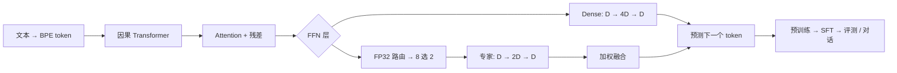
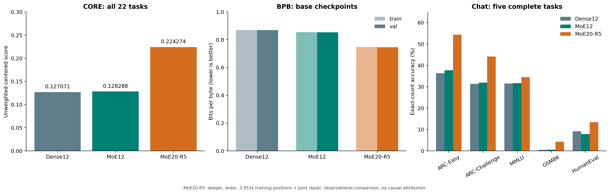
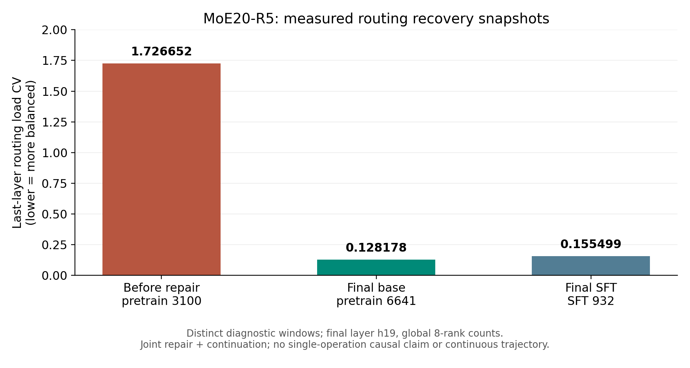

# NanoChat MoE

**从读懂 Dense 训练框架，到训练、检查和修复稀疏专家模型。**

[](LICENSE)
[](bundle/moe/pyproject.toml)


[English](README.md) · [简体中文](README.zh-CN.md) · [快速开始](#快速开始) · [实测结果](#实测结果) · [专家坍缩修复](docs/routing-repair.md)

本项目基于 [Andrej Karpathy 的 NanoChat](https://github.com/karpathy/nanochat/tree/92d63d4e8bb4df75c3b71618f31ddde2378b2bcd)，将交替 Transformer 层中的 Dense FFN 改为 **8 专家、Top-2 路由的 MoE**，保留分词器、预训练、全参数 SFT、检查点、评测和 KV Cache 推理的整体流程。

它适合想把 MoE 从公式学到代码、再学到真实训练问题的人：**看 token 去了哪些专家，发现 loss 没有暴露的坍缩，修复恢复点，完成全流程评测。**

## 你可以在这里做什么

- **读懂一个直接的 MoE 实现。** 每层 8 个独立 ReLU² 专家，FP32 路由、Top-2 门控归一化和负载均衡辅助损失；核心分发使用普通 PyTorch，便于检查前向与梯度。
- **复用完整语言模型训练框架。** Dense 基线和 MoE 并排保留，涵盖语料准备、BPE、预训练、SFT、评测及聊天。
- **检查专家使用情况。** 按层、专家统计选择份额、首选份额、gate mass、router probability 和 CV，并区分 prefill / decode，支持八卡汇总。
- **研究真实的坍缩与恢复。** 20 层训练中，末层约 99.8% 的专家分配集中到两个专家；修复方案通过固定窗口质量检查后，续跑完成预训练和 SFT。
- **比较实际训练结果。** 提供 Dense12、MoE12、MoE20-R5 的配置、完整评测结果和实验限制，便于继续做更严格的对照。

> **当前发布范围：** 源码、测试、训练与评测入口、实验表格及图。Base / SFT 权重**尚未公开托管，也不包含在 Git 仓库内**。你可以下载源码并自行训练；详情见[权重说明](docs/weights.md)。

## 架构：原框架内的稀疏 FFN



每隔两层放置一个 MoE 层，其余保留原 Dense FFN。专家参数按层独立：20 层模型有 **10 个 MoE 层、80 个专家 FFN**，没有跨层共用同一组 8 个专家。

原 Dense FFN 为 `D → 4D → D`，一个专家为 `D → 2D → D`。替换后八个专家的 FFN 矩阵参数总量约为原来的 **4 倍**；每 token 只运行两个专家，活跃 FFN 矩阵计算规模接近原版，另有路由和 gather/scatter 开销。因此需要实测速度，不能由稀疏参数公式直接推导加速倍数。

**八卡采用完整模型复制的数据并行，优化器更新及状态有分片。** 每张卡保存全部专家；当前没有专家并行、跨卡 token All-to-All 或 PyTorch DDP 包装器。

更多公式、混合精度、梯度及路由统计口径见[架构说明](docs/architecture.md)。

## 快速开始

### 1. 先运行不下载数据的小模型测试

需要 Python 3.10+ 和 [uv](https://docs.astral.sh/uv/)。下面的精选测试使用小模型，不下载数据集或预训练权重。

```bash
git clone https://github.com/lite93597/nanochat-moe.git nanochat-moe
cd nanochat-moe/bundle/moe
uv sync --extra cpu --group dev
NANOCHAT_DTYPE=float32 uv run --extra cpu --group dev pytest -q \
  tests/test_moe.py tests/test_moe_training_metrics.py \
  tests/test_moe_repair_diagnostics.py tests/test_infer_bench.py
```

Windows PowerShell：

```powershell
git clone https://github.com/lite93597/nanochat-moe.git nanochat-moe
cd nanochat-moe/bundle/moe
uv sync --extra cpu --group dev
$env:NANOCHAT_DTYPE = "float32"
uv run --extra cpu --group dev pytest -q tests/test_moe.py tests/test_moe_training_metrics.py tests/test_moe_repair_diagnostics.py tests/test_infer_bench.py
```

### 2. 在自己的 GPU 节点上训练

```bash
# 接着步骤1，在 bundle/moe 目录中运行。
uv sync --extra gpu --group dev
source .venv/bin/activate
export NANOCHAT_BASE_DIR=/persistent/nanochat-moe/models
export NANOCHAT_DATA_DIR=/persistent/nanochat-moe/data
export NANOCHAT_DTYPE=bfloat16
```

仓库根目录的 `runs/train_moe12.sh` / `runs/train_dense12.sh` 在已准备数据上执行预训练，`runs/evaluate.sh` 用于评测自己的 Base/SFT。接着阅读[复现指南](docs/reproduction.md)，按顺序准备语料和 tokenizer、短测显存与吞吐，再启动完整训练和评测。20 层 R5 成果包含真实恢复点上的修复，普通从头训练命令不会自动重现这段历史。

本项目实际使用 **8 张 RTX PRO 6000 Blackwell Server Edition**。不同节点需要重新短测，选择独立 `MODEL_TAG`，不要直接套用上游 Dense speedrun 的时间或显存结论。

### 3. 和自己训练的模型对话

确保 `NANOCHAT_BASE_DIR` 下已有对应 tokenizer 和 checkpoint：

```bash
python -m scripts.chat_cli -i sft -g YOUR_MODEL_TAG \
  -p "Explain why the sky looks blue." --max-tokens 128 \
  --moe-routing-output ./chat_routes.json
```

每次回答可以同时显示专家使用摘要，并输出路由 JSON。当前能力评测以英语为主，对话示例也采用英语。

## 实测结果



| 指标 | Dense12 | MoE12 | MoE20-R5 |
|---|---:|---:|---:|
| CORE，22 任务无权重中心化均值 ↑ | 0.127071 | 0.128288 | **0.224274** |
| Base 验证 BPB ↓ | 0.869251 | 0.853670 | **0.746360** |
| SFT ARC-Easy | 36.32% | 37.71% | **54.34%** |
| SFT ARC-Challenge | 31.40% | 31.91% | **44.11%** |
| SFT MMLU | 31.53% | 31.69% | **34.50%** |
| SFT GSM8K | 0.53% | 0.61% | **4.25%** |
| SFT HumanEval | 9.15% | 7.93% | **13.41%** |

正式流程包括 **22 项 CORE / 91,037 题、五项完整聊天任务**，以及 BPB、样例、推理测试和性能测试，共 **31 阶段**。CORE 是按随机基线中心化后的任务均值，不是全体题目原始准确率。

| 模型 | 层数 / 宽度 | MoE 层 | 总参数 | 活跃参数口径 | 预训练步数 | 配置预训练位置数 |
|---|---|---:|---:|---:|---:|---:|
| Dense12 | 12 / 768 | 0 | 286,261,730 | 286,261,730 | 1,680 | 880,803,840 |
| MoE12 | 12 / 768 | 6 | 371,233,250 | 286,298,594 | 1,680 | 880,803,840 |
| MoE20-R5 | 20 / 1280 | 10 | 1,289,852,146 | 896,636,146 | 6,641 | 3,481,796,608 |

预训练位置数不是唯一语料 token 数；活跃参数口径包括共享 embedding，也不等于实测 FLOPs。

**推理快照：** 单张 RTX PRO 6000，prompt256、decode64、temperature0，batch1 为 **58.0 tok/s**，batch8 **合计 454.3 tok/s**。batch8 是同一个 prompt 的八条生成分支，不能解释为八个独立用户的服务压测。Dense 在另一种显卡上测量，不能据此做架构速度排名。

### 怎样正确理解这些结果

- 20 层同时增加了**深度、宽度、训练量，并采用 R5 修复配方**；提升不能单独归因于 MoE 或层数。
- Dense12 / MoE12 的配置更接近，但任务表现有升有降，没有多随机种子显著性结论。
- **继承的 SFT 验证候选池包含部分 MMLU / GSM8K test，与最终 benchmark 有交叠。** 监控没有回传梯度，也没有用于选最佳检查点；最终测试仍然不能称为完全未查看。后续严格实验应从训练集独立划分验证集。
- 这些主要是英语基准结果，没有系统证明中文或专业领域助手能力；GSM8K 的绝对成绩仍低。
- 本轮实际执行预训练和全参数 SFT；保留的上游 RL 脚本不是已完成 RL 的证据。

详见[评测协议、完整题数和限制](docs/experiments.md)。

## 专家坍缩：loss 下降时仍要检查路由



末层曾出现两个专家占据约 99.8% 分配、多个专家零命中，而 BPB 仍下降。R5 用独立专家参数复制、对应优化器状态重置、训练窗口偏置校准及有界反馈恢复负载，再通过 100 步质量验收后完成完整训练。

| 末层诊断 | 最终预训练 | 最终 SFT |
|---|---:|---:|
| 负载 CV ↓ | 0.128178 | 0.155499 |
| 最小专家选择份额 | 10.4135% | 10.1877% |

最终诊断中八个专家都有使用，不同任务仍有不同偏好。极短 prompt 的个别零命中与长期专家坍缩需要分开判断。完整操作与边界见[修复案例](docs/routing-repair.md)。

## 从哪里开始读源码

```text
bundle/dense/       原版 Dense 对照快照
bundle/moe/         MoE 模型、训练、评测、推理与测试
cloud/             路由门禁和记录的模型配置契约
tools/             通用专家复制、训练logit偏置校准工具
research/          严格绑定历史来源的R5修复及审计实现
runs/              小模型检查、已备数据训练和评测入口
results/           公开实验表格和聚合数据
assets/            README 使用的图
docs/              架构、复现、评测、修复、权重说明
```

推荐阅读顺序：[MoE 核心](bundle/moe/nanochat/gpt.py) → [训练诊断](bundle/moe/nanochat/moe_training_metrics.py) → [路由报告](bundle/moe/nanochat/moe_report.py) → [优化器](bundle/moe/nanochat/optim.py) → [推理引擎](bundle/moe/nanochat/engine.py)。

## 一起继续改进

欢迎提交严格划分验证集、多 seed 同预算对照、grouped expert kernel、专家并行或真实服务压测等改进。请同时提供配置和测量方式，见[贡献指南](CONTRIBUTING.md)。

**如果这个项目帮助你理解、调试或复现 MoE，欢迎点一个 Star，让更多人找到它。** 如果你在另一种 GPU 上跑通，或尝试了更简单的稳定路由方案，也欢迎分享实际结果。

## 来源与许可

本项目是 [NanoChat](https://github.com/karpathy/nanochat) 的独立扩展。原模型、tokenizer、优化器、任务框架和推理设计来自 Andrej Karpathy 及上游贡献者，具体对照快照记录在 [NOTICE.md](NOTICE.md)。原 MIT 声明保留；仓库代码采用 [MIT](LICENSE)。数据集和未来可能托管的模型权重需要单独遵循其来源与条款，代码许可不重新授权第三方数据。
